<picture>
  <source media="(prefers-color-scheme: dark)" srcset="./dark.svg">
  <source media="(prefers-color-scheme: light)" srcset="./light.svg">
  
</picture>

---

### 🔭 Currently

Second-year BSc student in **Mathematics & Computer Science** at the **University of Helsinki**, focused on **mobile development** and **AI/ML**. Building iOS apps in Swift/SwiftUI, shipping cross-platform wrappers with Capacitor.js, and training models with scikit-learn.

### 🛠️ Stack

**Languages** — Swift · Python · C++ · JavaScript
**Frameworks** — SwiftUI · React · Capacitor.js · scikit-learn · NumPy · Pandas
**Tools** — SQL · Git · Linux

### 📫 Reach me

- **Email** — [gorovoi.dmitrii@gmail.com](mailto:gorovoi.dmitrii@gmail.com)
- **LinkedIn** — [dmitrii-gorovoi](https://www.linkedin.com/in/dmitrii-gorovoi)
- **Instagram** — [@dm_g__](https://instagram.com/dm_g__)

The banner is pure SVG + SMIL — no JavaScript. The ASCII portrait is generated from a photo with <code>swift tools/photo_to_ascii.swift &lt;photo&gt; 66 0.52 &gt; tools/portrait.txt</code>, then the banner is rebuilt with <code>python3 tools/generate_hero.py</code>.
